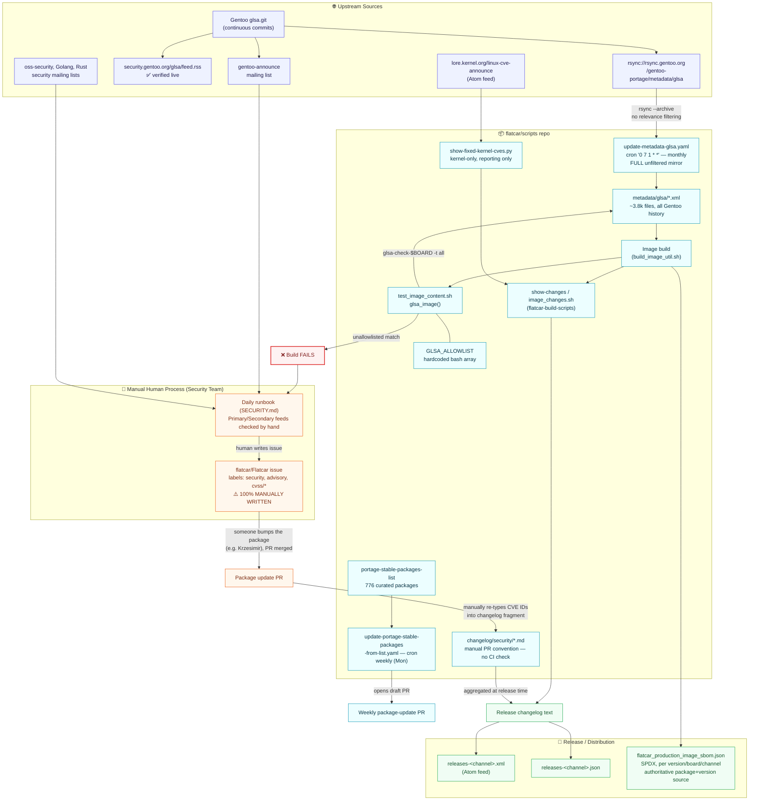
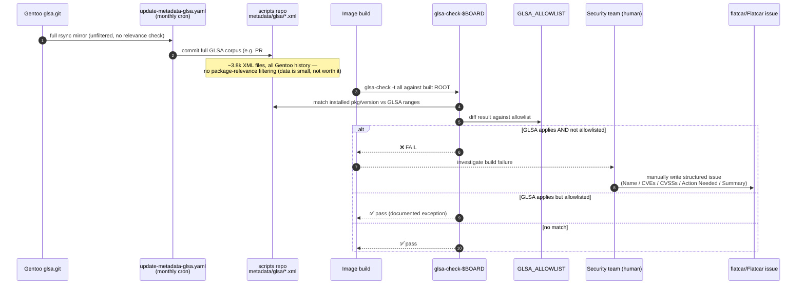
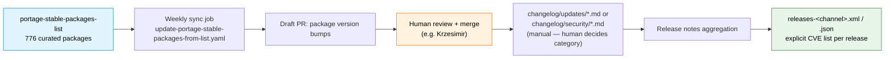
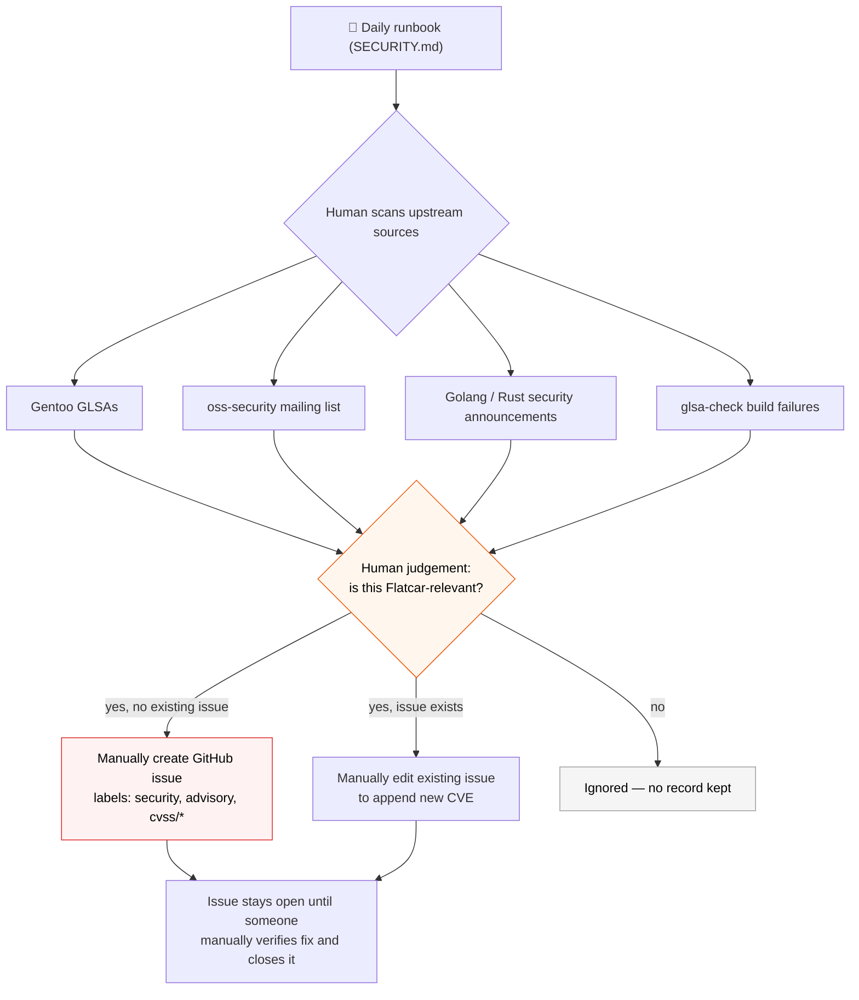
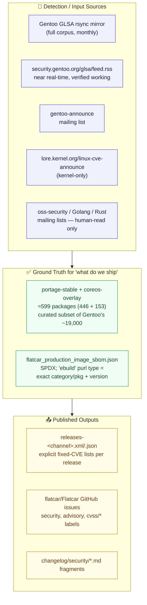

# Flatcar Security/CVE Handling — Current State (As-Is)

> **Compiled from:** direct inspection of `flatcar/scripts`, `flatcar/Flatcar`,
> `flatcar/jenkins-os`, `flatcar/flatcar-build-scripts`, live GitHub issue/PR queries, the
> real `security.gentoo.org` RSS feed, and a Slack conversation with **Dongsu Park**
> (2026-07-17). Every fact below was verified against source (file paths and commands are
> cited in §7); nothing here is speculative.
>
> **Scope note:** this document describes **what exists today**. It is deliberately *not*
> a proposal — the target VEX design is a separate follow-up document.

**Contents:** [1. Executive Summary](#1-executive-summary) · [2. Overall Map](#2-overall-map) ·
[3. Path A — GLSA Build Gate](#3-path-a--glsa-build-gate-lifecycle) ·
[4. Path B — Routine Updates](#4-path-b--routine--weekly-package-updates-independent-of-glsa) ·
[5. Path C — Manual Advisory Tracking](#5-path-c--manual-advisory-issue-tracking) ·
[6. Data Sources Inventory](#6-data-sources-inventory) ·
[7. Known Gaps](#7-known-gaps-in-the-current-state) ·
[8. Verified Facts Reference](#8-verified-facts-reference)

---

## 1. Executive Summary

There are **two largely decoupled mechanisms** by which vulnerabilities get addressed in
Flatcar today, plus a **third, purely manual** communication layer sitting on top of both.
There is currently **no machine-readable VEX output anywhere** in this system.

| # | Mechanism | Covers | Automated? | Blocks a build? |
|---|-----------|--------|:---:|:---:|
| **A** | `glsa-check` build gate | Only CVEs Gentoo wrote a formal GLSA for | Detection: ✅ · Triage: ❌ | ✅ Yes |
| **B** | Routine / weekly package updates | The majority of real-world CVE fixes | Sync: ✅ · Review/merge: ❌ | ❌ No |
| **C** | Manual advisory issues (`flatcar/Flatcar`) | Human-curated superset, independent of A/B | ❌ 100% manual | ❌ No |

> **Key correction from Dongsu Park:** A and B are **largely independent**. Most CVEs are
> fixed as a *side effect* of ordinary package-freshness bumps (Path B) — not because a
> GLSA ever fired. GLSA/`glsa-check` (Path A) only ever sees "a limited list of CVEs."

---

## 2. Overall Map



---

## 3. Path A — GLSA Build-Gate Lifecycle

This is the **only fully automated *detection*** mechanism in the current system — but it
only fires for the subset of CVEs that have a formal Gentoo GLSA, and only at **build
time**, against whatever is currently being built (not already-shipped releases).



**Source:** `build_library/test_image_content.sh` → `glsa_image()`, invoked from
`build_image_util.sh` (`test_image_content()`).

---

## 4. Path B — Routine / Weekly Package Updates (Independent of GLSA)

Per Dongsu: **most real CVE fixes happen here**, not via Path A. A package gets bumped for
ordinary freshness reasons; if that bump happens to cross a CVE-fixed version boundary, the
CVE is fixed as a side effect — with no GLSA or `glsa-check` failure ever involved.



---

## 5. Path C — Manual Advisory Issue Tracking

Confirmed directly by Dongsu: **"Those are all manually created"** — referring to the
`advisory`-labeled issues in `flatcar/Flatcar` (**331 total, 46 currently open** as of this
review — see §8).



**Observed issue body template** (consistent across years/authors, still 100% hand-typed):

```markdown
Name: <package>
CVEs: <CVE-1>, <CVE-2>, ...
CVSSs: <score-1>, <score-2>, ...
Action Needed: update to >= <version>
Summary: <upstream description>
```

Severity labels — `cvss/CRITICAL` (≥9), `cvss/HIGH` (7–9), `cvss/MEDIUM` (4–7) — are also
assigned by hand, consistently enough to look templated, but no code anywhere produces them.
A single issue (e.g. [#2188](https://github.com/flatcar/Flatcar/issues/2188)) can bundle
**multiple CVEs with different `Action Needed` thresholds** — an important edge case for any
future automation.

---

## 6. Data Sources Inventory



> `G1` is a reliable **existence proxy** ("is this package used by Flatcar at all") but not
> sufficient alone to prove something is in the *production-shipped* image (it could be
> SDK-only or sysext-only). `G2` (the SBOM) is authoritative for that finer distinction and
> is also the only source that ties an exact **version** to a **released** artifact.

---

## 7. Known Gaps in the Current State

| # | Gap | Why it matters |
|---|-----|-----------------|
| 1 | **No automated relevance filtering** | A human must eyeball every new GLSA/CVE against Flatcar's package list; nothing does this today. |
| 2 | **GLSA coverage is narrow** | Most real fixes happen via Path B, invisible to `glsa-check` entirely, since A and B are decoupled. |
| 3 | **Advisory issue creation is 100% manual** | `SECURITY.md` claims *"we... use automation tools to create a new issue"* — confirmed **false** by Dongsu. |
| 4 | **CVE IDs re-typed by hand, twice** | Once into the GitHub issue, again into `changelog/security/*.md` — no automated link, no CI enforcement that the fragment is even added. |
| 5 | **No VEX output anywhere** | Nothing here produces a machine-readable VEX document; the closest analogues are hand-written issue bodies and release-note CVE lists. |
| 6 | **No queryable "shipped version X ↔ still-affected-by CVE Y" record** | That information lives only in prose (issue comments like *"Fixed in Beta 4722.1.0, Stable 4593.2.4, LTS 4081.3.9"*). |

---

## 8. Verified Facts Reference

Every quantitative claim above was checked against a primary source on 2026-07-17:

| Claim | Verified value | Source |
|---|---|---|
| GLSA sync cadence | `cron: '0 7 1 * *'` (monthly, 1st) | `scripts/.github/workflows/update-metadata-glsa.yaml` |
| Weekly package sync cadence | `cron: '0 7 * * 1'` (weekly, Monday) | `scripts/.github/workflows/update-portage-stable-packages-from-list.yaml` |
| Local GLSA XML mirror size | 3,817 files | `find scripts -iname 'glsa-*.xml' \| wc -l` |
| Curated package list size | 776 entries | `scripts/.github/workflows/portage-stable-packages-list` |
| Package tree size (ground truth) | 446 (`portage-stable`) + 153 (`coreos-overlay`) = **599** | GitHub API tree listing, `flatcar-archive/portage-stable` & `flatcar-archive/coreos-overlay` @ `main` |
| Build gate function | `glsa_image()` → `glsa-check-$BOARD -t all` vs `GLSA_ALLOWLIST` | `scripts/build_library/test_image_content.sh` |
| `advisory`-labeled issues | 331 total, 46 open | GitHub Search API, `repo:flatcar/Flatcar label:advisory` |
| "Automation" claim in docs | Present, contradicted by Dongsu | `Flatcar/SECURITY.md` line 28 |
| GLSA RSS feed | Live and working | `https://security.gentoo.org/glsa/feed.rss` |
| GLSA notification mailing list | `gentoo-announce` | Gentoo project documentation |
