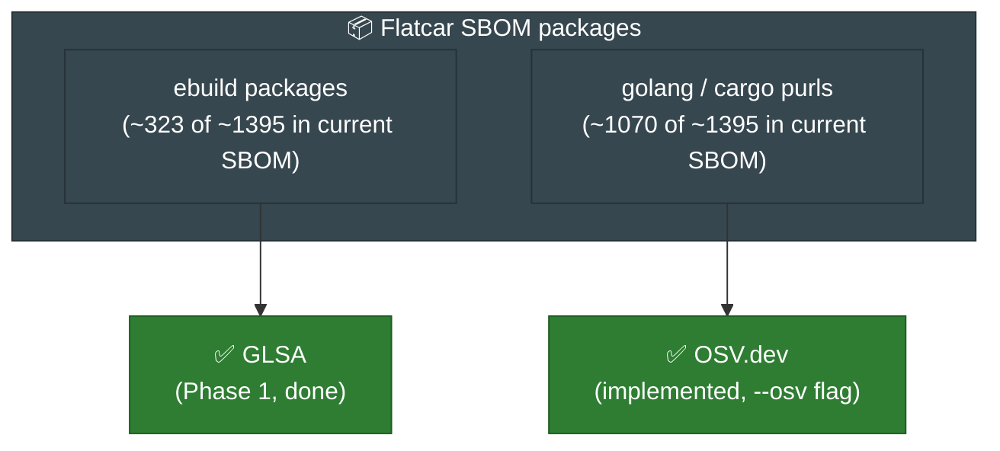
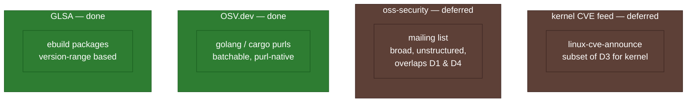
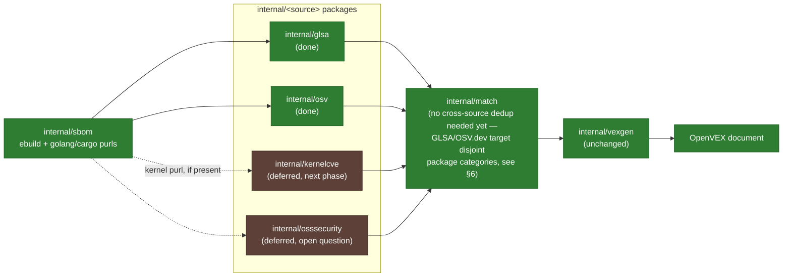
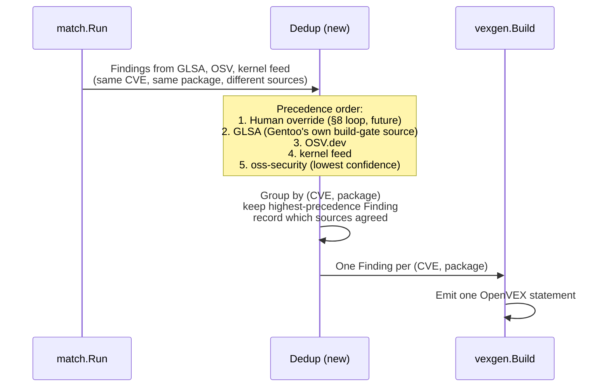

# Multi-Source CVE Coverage — Proposal (Draft, for Review)

> **Implementation status:** `internal/osv` (this proposal's §6 Step 1) is implemented, see
> `docs/plan.md` Decision Log #10 (pending review/merge in the PR that introduces it).
> `internal/kernelcve` and `internal/osssecurity` remain deferred, not committed to any phase.
> The rest of this document is preserved as originally written for its design rationale; only
> the diagrams and tables directly describing OSV.dev's status have been updated to reflect
> that it is now implemented.

> Companion to [`plan.md`](./plan.md) (Decision Log #2, Future Phase candidates §7, Open
> Question #8) and [`current-state.md`](./current-state.md). GLSA-based matching (Phase 1)
> is done and merged (`internal/glsa`, `internal/match`). This proposes how to add the
> remaining sources from the coverage diagram in `plan.md` §10 so non-`ebuild` packages and
> non-GLSA advisories are covered too. **Nothing in this document is committed** — it is a
> proposal for review, one level below `plan.md`'s Decision Log.

**Contents:** [1. Why now](#1-why-now) · [2. Coverage gap](#2-coverage-gap) ·
[3. Prior art: `security-triage`](#3-prior-art-security-triage) ·
[4. Proposed design](#4-proposed-design) · [5. Dedup & precedence](#5-dedup--precedence-open-question-8) ·
[6. Rollout phasing](#6-rollout-phasing) · [7. Questions for review](#7-questions-for-review)

---

## 1. Why now

Phase 1 proved the mechanic (SBOM → match → OpenVEX) using GLSA alone. Real-data testing
(`.local/`) confirms it works end-to-end, but GLSA only covers Gentoo `ebuild` packages,
roughly 323 of the ~1395 packages in the current production SBOM, and **zero** of the
remaining ~1070 Go/Rust-ecosystem packages that ship in the same SBOM.

## 2. Coverage gap



Per `plan.md` §10's Venn diagram, three more sources exist beyond GLSA, each with a
different scope and a different overlap risk:



## 3. Prior art: `security-triage`

Daniel's `security-triage` (referenced in `security-triage/`) already solves upstream
*fetching* for three of these sources: `oss_security.py`, `go_vulndb.py`, `rustsec.py`, plus
Gentoo Bugzilla. It's a strong reference for **how to talk to each upstream**, but its job is
different from this tool's:

| | `security-triage` | `flatcar-vex` (this repo) |
|---|---|---|
| Output | GitHub advisory issues (human-gated review/apply) | OpenVEX JSON documents |
| Decision maker | LLM (Foundry/GitHub Models) + human review | Deterministic version-range match |
| Granularity | One issue per package/update | One VEX statement per CVE+product |
| State | GitHub issue body/labels | Rolling-forward VEX files (`plan.md` §5) |

**What to borrow:** the per-source fetcher pattern — a small adapter per upstream that
normalizes into one common record shape (`SourceEntry` in their `records.py`), with disk
caching (`--*-cache-dir` flags) and a documented window/freshness rule per source. That
pattern maps directly onto this repo's existing `internal/glsa` shape.

**What NOT to borrow:** the LLM-based relevance/triage layer. This tool's matching must stay
deterministic and auditable (per `plan.md` Decision Log #2, "nothing here is inferred/guessed"),
so OSV/kernel/oss-security integration should reuse **only** the fetch/normalize step, not any
AI-based judgment call.

## 4. Proposed design

Mirror the existing `internal/glsa` → `internal/match` shape: each new source gets its own
package that parses upstream data into `match.Finding`-compatible records, so `match.Run` and
`vexgen.Build` don't need to change.



**Per-source notes:**

- **`internal/osv`** (implemented, see `docs/plan.md` Decision Log #10): OSV.dev's `POST
  api.osv.dev/v1/querybatch` is purl-native and batchable: request body is
  `{"queries":[{"package":{"purl":"pkg:golang/...@v1.2.3"}}, ...]}`, one query per SBOM
  package, response ordering guaranteed to match the input (verified directly against
  `google.github.io/osv.dev`'s API reference). **Caveat confirmed while writing this
  proposal:** `querybatch` returns only vulnerability IDs + `modified` timestamps, not full
  advisory data, so a second `GET /v1/vulns/{id}` call per unique ID returned is needed to get
  the affected-range/CVSS data actually required to build a `Finding`; OSV.dev has no
  batch-fetch-by-ID endpoint, so this is implemented as bounded-concurrency requests (see
  `internal/osv`'s `VulnFetchConcurrency`) rather than one request per ID sequentially. This
  two-step shape still fits a single HTTP-based adapter, no XML corpus to mirror like GLSA.
  Produces `Finding`s for golang/cargo purls only, with no overlap with GLSA's ebuild scope, so no
  dedup conflict arose in practice.
- **`internal/kernelcve`** (deferred to a later phase, decided during this proposal's review):
  `lore.kernel.org/linux-cve-announce` is a public Atom feed (`new.atom`), no auth needed,
  confirmed directly. Its body includes a structured "Affected and fixed versions" block
  (one line per stable branch: `Issue introduced in X with commit Y and fixed in Z with commit
  W`) that would need parsing per line, then matching against whichever single branch Flatcar
  tracks. **Correction from this proposal's original draft:** `security-triage` does **not**
  actually fetch this feed anywhere — its only "kernel" logic is a suppression rule
  (`is_kernel_advisory()` in `rules.py`) that recognizes kernel-related advisories from *other*
  sources and skips creating a GitHub issue for them, per Flatcar's policy of tracking kernel
  security via routine stable-kernel bumps rather than per-CVE issues. So this would be
  genuinely new work, not adapting a proven pattern — a reasonable basis for deferring it
  behind `internal/osv` rather than building it next.
- **`internal/osssecurity`** (also deferred, higher-risk): unstructured mailing
  list text, closest analogue to `security-triage`'s `oss_security.py` scraper. This is the
  source most likely to require an LLM-assisted extraction step to pull structured CVE/package
  data out of free text — which conflicts with this tool's "deterministic only" design goal
  (§3 above). Proposing this be explicitly deferred until a decision is made on whether any
  non-deterministic step is acceptable here, and if so, how its output is marked lower-confidence
  in the resulting VEX (e.g. a distinct `justification`).

## 5. Dedup & precedence (Open Question #8)

> **Implementation note:** `Source` and `RefID` are now implemented fields in `match.Finding`
> (added as part of the OSV.dev integration, see Decision Log #10 in `plan.md`). The opening
> sentence below and the code block are preserved as original proposal text for design-rationale
> context; the struct shown below reflects the current implementation, not a future proposal.

`match.Finding` carries a `Source` field and a `RefID` per source, plus a fixed precedence
order is proposed so exactly one VEX statement is emitted per (CVE, package) once sources
with overlapping scope are added:



Current `Finding` fields relevant to multi-source dedup (already implemented):

```go
type Finding struct {
    CVE      string
    Package  sbom.Package
    Affected bool
    Source   string   // "glsa", "osv"; future: "kernel-cve", "oss-security"
    RefID    string   // source-specific advisory ID (GLSA ID or OSV.dev vuln ID)
}
```

## 6. Rollout phasing

**Decision (made during this proposal's review): only `internal/osv` is scoped for the
immediate next phase.** Both `internal/kernelcve` and `internal/osssecurity` are deferred —
neither has proven prior art to adapt (see §4 correction on `security-triage`'s kernel
handling), so both need their own follow-up design discussion before implementation, not just
a slot in this rollout table.

> **Status: `internal/osv` is implemented** (`internal/osv`, `internal/match.RunOSV`,
> `generate --osv`). Step 2 (a dedicated dedup/precedence layer) turned out to be
> unnecessary for this pairing: GLSA and OSV.dev match disjoint package categories (`ebuild`
> vs. `golang`/`cargo`), so there is no case today where both sources report the same
> package for the same CVE. `vexgen` already deduplicates subcomponents by purl within a
> (CVE, status) group and labels findings by source (see `docs/plan.md` Decision Log #10),
> which is sufficient while sources don't overlap. A real dedup/precedence layer (Open
> Question #8) remains a prerequisite for `internal/kernelcve`/`internal/osssecurity`, since
> either could plausibly flag the same package the other sources also cover.

| Step | Source | Effort | Rationale |
|---|---|---|---|
| 1 | `internal/osv` | Small | Purl-native API, no corpus mirroring, closes the largest coverage gap (~1070 of ~1395 SBOM packages, 0% covered today). **Implemented** — see status note above. |
| 2 | Dedup/precedence layer in `internal/match` | Small | Needed before adding any further source to avoid double-counting; also resolves Open Question #8. **Not needed for OSV.dev** (disjoint package categories from GLSA — see status note above); still needed before `internal/kernelcve`/`internal/osssecurity`. |
| — | `internal/kernelcve` | Deferred to next phase | Genuinely new work, not adapting a proven pattern (see §4) — needs its own design pass covering Atom-feed parsing, branch matching, and caching before scoping |
| — | `internal/osssecurity` | Deferred, open question | Needs a decision on non-deterministic extraction (§4) before scoping |

Each step is independently shippable and testable, following the same pattern as the existing
`internal/glsa` package (fixtures + table tests, no live network calls in unit tests).

## 7. Questions for review

1. Does the proposed precedence order (human override > GLSA > OSV > kernel feed > oss-security)
   match your intuition, or should GLSA and OSV be considered equally authoritative for
   packages only one of them covers? (Kernel feed and oss-security's positions in this order
   are forward-looking, since both are now deferred — §6.)
2. Should `internal/osssecurity` be scoped at all in this project, given it's the one source
   that doesn't fit the deterministic-only design goal, or should oss-security coverage stay
   entirely inside `security-triage`'s existing scraper?
3. ~~OK to start with `internal/osv` as the very next implementation task?~~ **Decided:** yes —
   `internal/osv` is the only source scoped for immediate implementation; `internal/kernelcve`
   and `internal/osssecurity` are both deferred to a later phase (§6).
