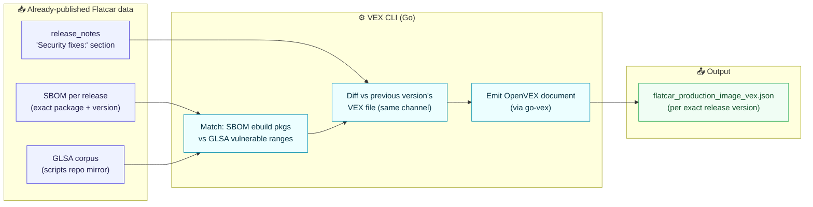
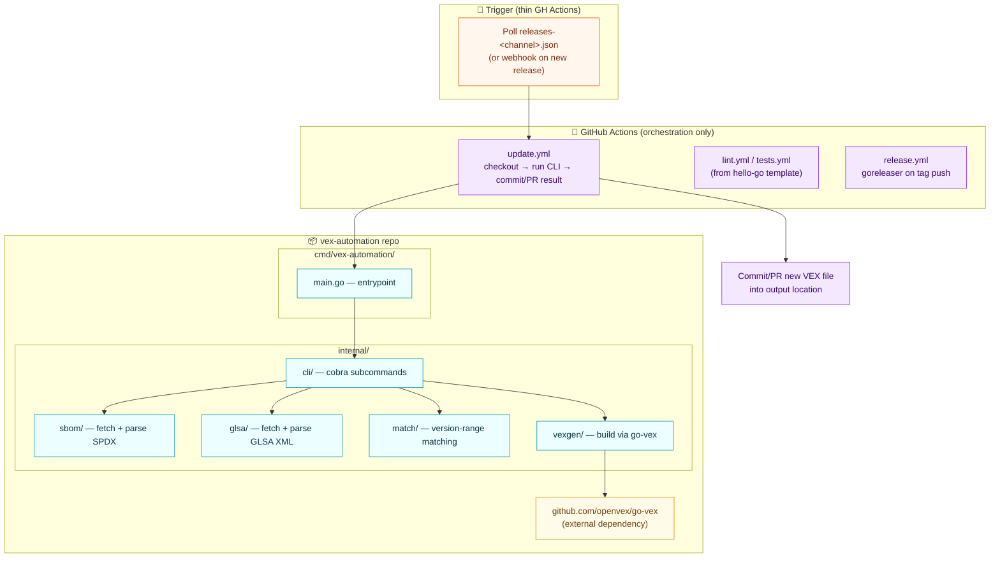
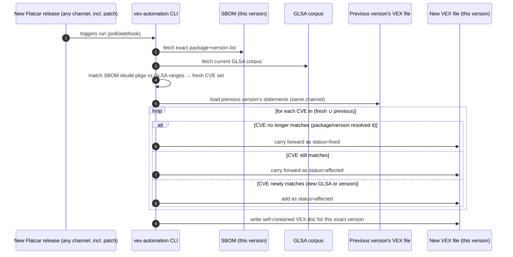

# Flatcar VEX Automation — Design Plan

> Companion to [`current-state.md`](./current-state.md) (the as-is system). This is a
> **phased roadmap** — not a single fixed architecture. **Phase 1 is a proof of concept**:
> deliberately narrow, meant to prove the core mechanic (release → VEX) works before
> anything more ambitious is committed to. **Everything past Phase 1** is grouped under
> "Future Phases" for now — that bucket may end up being one phase or several (Phase 2,
> Phase 3, ...); it isn't scoped or sequenced yet, just a holding area for candidates and
> open tensions so they aren't lost.

**Status:** Phase 1 (PoC) design agreed, implementation not yet started. Future Phases are discussion-only — not committed, not sequenced, not necessarily "Phase 2" as a single next step.

**Contents:**

**Phase 1 — PoC (committed scope):** [1. Goals & Non-Goals](#1-goals--non-goals) ·
[2. Decision Log](#2-decision-log) ·
[3. PoC Scope](#3-poc-scope) ·
[4. Architecture](#4-architecture) ·
[5. Rolling-Forward Mechanic](#5-rolling-forward-mechanic) ·
[6. Tech Stack & Repo Layout](#6-tech-stack--repo-layout)

**Future Phases (not committed, not sequenced):** [7. Future Phase Candidates](#7-future-phase-candidates-not-committed-not-sequenced) ·
[8. Human-Override Loop](#8-human-override-loop-detail) ·
[9. Open Questions](#9-open-questions)

---

# 🚀 PHASE 1 — Proof of Concept (Committed Scope)

> Everything in sections 1–6 below is the agreed, in-progress **PoC** design — deliberately
> the smallest slice that proves the core release→VEX mechanic end-to-end. It is not meant
> to be feature-complete or production-final; it's meant to be small enough to ship and
> learn from before deciding what comes next. Nothing here is speculative.

## 1. Goals & Non-Goals

**Goal (PoC):** Produce a machine-readable, spec-compliant **OpenVEX** document for every
released Flatcar version (all channels, including patch releases), derived only from data
Flatcar has already published — no speculative "affected" claims yet. The point of this
phase is to prove the release→VEX mechanic works end-to-end on real data, not to cover
every case.

**Explicit non-goals for the PoC** (deferred, not rejected — see the Future Phases §7 for these as candidates):
- No backward historical backfill / no attempt to determine exactly when a CVE started
  affecting older releases.
- No AI-assisted triage of new GLSAs into GitHub issues (the "Slow Path" from the original
  sketch) — that's a separate, later phase.
- No coverage of non-`ebuild` packages (golang/rust modules in the SBOM) yet — GLSA-based
  matching only for the PoC (see Future Phases candidate #1, OSV.dev).
- No decision yet on public hosting/publishing location for the resulting VEX files
  (see Open Questions #2).

---

## 2. Decision Log

| # | Decision | Rationale |
|---|----------|-----------|
| 1 | **PoC only covers current + new releases**, no historical backfill | Avoids the unresolved question of "how far back was a CVE actually exploitable" — sidestepped entirely by never looking backward. |
| 2 | **Ground truth = already-released data only**: SBOM (exact package+version) + GLSA (vulnerability ranges) + published security changelog text | Nothing here is inferred/guessed; every VEX statement traces to a fact Flatcar already published. |
| 3 | **One VEX file per exact release version** (not one monolithic file, not one per minor line) | Mirrors the existing per-version SBOM publishing pattern; matches standard supply-chain practice of colocating VEX with its artifact; keeps each file self-contained and independently fetchable. |
| 4 | **Every release matters, including patch releases** | Patch releases are the primary CVE-fix vehicle (per Dongsu, most fixes land via routine bumps) — coarser granularity would miss the exact events this system exists to track. |
| 5 | **Rolling-forward model**: bootstrap once from each channel's current head, then carry state forward release-to-release (diff against the immediately preceding version) | Avoids needing full history; naturally self-correcting as new data arrives. |
| 6 | **Language: Go** | OpenVEX's reference implementation (`go-vex`, `vexctl`) is Go, maintained by the spec authors under the official `openvex` GitHub org. Python's only option (`vexipy`) is an unofficial, single-maintainer reimplementation outside that org. Using `go-vex` gives spec-correctness, validation, and merge support for free. |
| 7 | **Architecture: CLI tool + thin GitHub Actions orchestration**, not logic embedded in workflow YAML | Matches existing Flatcar convention (`show-fixed-kernel-cves.py`, `sync_with_gentoo.sh` are real scripts called from workflows). Keeps matching/diffing/VEX-generation logic unit-testable, locally runnable, and versionable independent of any CI trigger. |
| 8 | **Project scaffold: adapt the [`hello-go`](https://github.com/John15321/hello-go) template** | Modern Go 1.24+ tool-dependency pattern, cobra CLI, clean `cmd/`+`internal/` layout, working lint/test/release CI already wired up — solid base to extend rather than build from scratch. |
| 9 | **License: Apache-2.0** (already resolved, not open) | The `vex-automation` repo scaffold already ships an Apache-2.0 `LICENSE` file. [`hello-go`](https://github.com/John15321/hello-go)'s own MIT license needs to be dropped when adapting the template — the repo's existing Apache-2.0 wins, and it also matches `go-vex`'s license. |

---

## 3. PoC Scope



---

## 4. Architecture



---

## 5. Rolling-Forward Mechanic



**Bootstrap case** (first run per channel): there is no "previous version" — the CLI runs
once against each channel's *current* head only, with an empty previous state, producing the
initial `affected` set to roll forward from. No history before that point is touched.

---

## 6. Tech Stack & Repo Layout

> Scaffold reference: [`John15321/hello-go`](https://github.com/John15321/hello-go)

| Concern | Choice | Source |
|---|---|---|
| Language | Go | Decision Log #6 |
| CLI framework | [`spf13/cobra`](https://github.com/spf13/cobra) | via [`hello-go`](https://github.com/John15321/hello-go) template |
| VEX generation | [`github.com/openvex/go-vex`](https://github.com/openvex/go-vex) | official OpenVEX reference implementation |
| Lint | `golangci-lint` (errcheck, govet, staticcheck, unused, misspell, revive, gocritic) | [`hello-go`](https://github.com/John15321/hello-go) `.golangci.yml` |
| Test runner | `gotestsum` (race + coverage) | [`hello-go`](https://github.com/John15321/hello-go) Makefile |
| Release | `goreleaser` (cross-compiled linux/darwin/windows × amd64/arm64, triggered on tag push) | [`hello-go`](https://github.com/John15321/hello-go) `.goreleaser.yaml` |
| Dev tooling | Go 1.24+ `tool` directives in `go.mod` — no global installs | [`hello-go`](https://github.com/John15321/hello-go) template |
| CI orchestration | Thin GitHub Actions (`lint.yml`, `tests.yml`, `release.yml` reused as-is; new `update.yml` for the actual VEX pipeline) | [`hello-go`](https://github.com/John15321/hello-go) + this plan |

**Planned repo layout** (adapted from [`hello-go`](https://github.com/John15321/hello-go)):

```
vex-automation/
├── cmd/vex-automation/main.go       entrypoint
├── internal/
│   ├── cli/                         cobra subcommands (bootstrap, update, match, ...)
│   ├── sbom/                        fetch + parse SPDX SBOM
│   ├── glsa/                        fetch + parse GLSA XML corpus
│   ├── match/                       package/version-range matching logic
│   └── vexgen/                      build OpenVEX docs via go-vex
├── docs/
│   ├── current-state.md             (existing)
│   └── plan.md                      (this file)
└── .github/workflows/
    ├── lint.yml / tests.yml         (from hello-go, reused)
    ├── release.yml                  (from hello-go, reused)
    └── update.yml                   (new — the actual VEX-generation trigger)
```

---

# 🔭 FUTURE PHASES — Candidates (Not Committed, Not Sequenced)

> Everything in sections 7–9 below is discussion/brainstorming only — **nothing here is
> agreed, scheduled, or numbered as a specific next phase**. This may become one phase or
> several; it's a holding area for candidates and open tensions surfaced while designing
> the PoC, kept here so they aren't lost, not commitments.

## 7. Future Phase Candidates (not committed, not sequenced)

| # | Candidate | Why |
|---|-----------|-----|
| 1 | **OSV.dev integration** for non-`ebuild` packages | SBOM's golang purls (1070 of ~1400 packages) have zero GLSA coverage today. OSV.dev's API is purl-native (`{"package":{"purl":"pkg:golang/...@v1.2.3"}}`, batchable) and already aggregates Go vulndb, GHSA, RustSec, PyPI Advisory DB — one integration instead of many. |
| 2 | **Kernel CVE feed** (`lore.kernel.org/linux-cve-announce`) as its own source | Kernel CVEs largely have no formal GLSA; this feed already exists and is proven (used by `show-fixed-kernel-cves.py`) but currently only feeds changelog text, not VEX. |
| 3 | **Human-override loop** — connect the existing manual advisory issues (Path C) to VEX | See §8 below — the key mechanism for correcting "assumed affected" GLSA/OSV matches once a maintainer determines Flatcar isn't actually exploitable. |
| 4 | **Real-time trigger via GLSA RSS feed** (`security.gentoo.org/glsa/feed.rss`, verified live) | Decouples "affected" detection from Flatcar's own monthly rsync cadence — closer to the original plan's "Fast Path," updates between releases rather than only at release time. |
| 5 | **Combined rollup VEX file** | Aggregated "all channels/versions" feed for consumers (e.g. NVD) who want one fetch — generated *from* the per-release files, not a new source of truth. |

---

## 8. Human-Override Loop (detail)

**Problem:** the PoC's GLSA/OSV matching produces `affected` statements purely from version-range
matching. Per Dongsu, a considerable number of these don't actually affect Flatcar in
practice (wrong build config, code path never executed, etc.) — today a human resolves this
by hand in the existing manual advisory issues (Path C), but that resolution never reaches
the VEX file.

**Proposed mechanism:**
- A small labeling convention on top of the *existing* advisory issue process (e.g.
  `vex/not-affected`, `vex/affected`, `vex/fixed`), applied **per CVE**, since one issue can
  bundle multiple CVEs with different resolutions (confirmed via issue #2188).
- **Dual trigger**, mirroring the existing GLSA sync + build-gate redundancy pattern already
  used elsewhere in this project:
  - Event-driven (`on: issues: types: [labeled, closed]`) for near-real-time updates.
  - Scheduled reconciliation cron as a safety net for anything the webhook missed.
- Maps to OpenVEX's `not_affected` status with an explicit `justification` (one of the 5
  spec-defined values, e.g. `vulnerable_code_not_in_execute_path` from the original sketch).
- **Integrates into the rolling-forward mechanic (§5)** as a new authoritative input: when
  computing a CVE's status for a release, check for a human override *first*, falling back
  to raw SBOM/GLSA/OSV matching only if none exists.

**⚠️ Open tension — VEX document immutability is unresolved, not decided:**
A human override may need to correct a CVE's status across **every already-published
per-release VEX file** where it appears, not just new ones going forward. We discussed this
and leaned toward "patch retroactively" for accuracy, but that conflicts with the general
expectation that published VEX documents (like SBOMs) are immutable release artifacts —
a consumer who cached an older file would be silently out of date with no signal, unless
every retroactive patch also bumps that document's `version`/timestamp fields so re-fetching
is detectable. **This tradeoff (accuracy vs. immutability) is explicitly still up for debate**
and needs a real decision — including whether "retroactive patch" is even acceptable to
downstream consumers — before any future-phase implementation, not just a default assumption.

---

## 9. Open Questions

These are deliberately unresolved — flagged for a future decision, not blocking PoC design:

1. **Product identifier scheme** for OpenVEX `product` field (purl vs CPE, and exact format
   for "this exact Flatcar release on this channel/arch").
2. **Publishing location** for generated VEX files — colocated with release artifacts
   (needs release-pipeline integration) vs. hosted separately (e.g. GitHub Pages / repo
   artifact keyed by version) for this first iteration.
3. **Combined rollup file** — whether/when to generate an aggregated "all channels/versions"
   VEX document from the per-release files, for consumers like NVD that may want one feed.
4. **Non-`ebuild` package coverage** — see Future Phases candidate #1 (OSV.dev).
5. **Config loading** — flags-only for the PoC, or introduce a config file once inputs
   (GLSA path, SBOM URL template, output path) multiply.
6. **AI-assisted triage / GitHub issue integration** ("Slow Path" from the original sketch)
   — explicitly deferred; this plan covers only the release→VEX sync.
7. **VEX document immutability vs. retroactive correction** — see §8. Unresolved: whether
   published per-release VEX files should ever be rewritten after the fact, and if so, how
   consumers are meant to detect the change.
